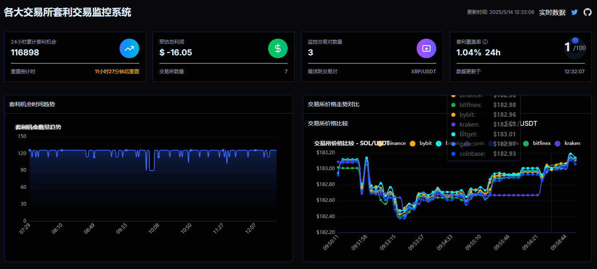
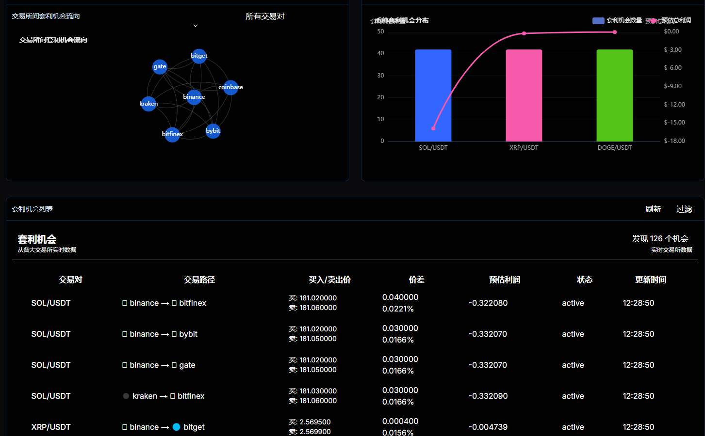

# Arbitrage Trading Monitor

*[中文版本](#中文版本)*

## Overview

Arbitrage Trading Monitor is a real-time system for monitoring and visualizing cryptocurrency arbitrage opportunities across major exchanges. The platform continuously tracks price differences between exchanges, identifies profitable trading opportunities, and presents them through an intuitive dashboard with interactive visualizations.

## Features

- **Real-time monitoring**: Continuously scans multiple cryptocurrency exchanges for price differences
- **Comprehensive visualization**: Advanced charts including time series, price trends, Sankey flow diagrams, and coin distribution charts
- **Detailed analytics**: Track 24-hour statistics on opportunities, maximum profit, and average profit
- **Filterable data table**: View and sort all detected arbitrage opportunities with detailed metrics
- **Responsive design**: Fully functional across desktop and mobile devices

## Screenshots




## Getting Started

### Prerequisites

- Node.js (v16+)
- npm or yarn
- Git

### Installation

1. Clone the repository:
   ```bash
   git clone https://github.com/snjyor/arbitrage-trading.git
   cd arbitrage-trading
   ```

2. Install dependencies:
   ```bash
   npm install
   # or
   yarn install
   ```

3. Set up environment variables:
   not yet

4. Start the development server:
   ```bash
   npm run dev
   # or
   yarn dev
   ```

5. Open your browser and navigate to `http://localhost:3000`

## Technology Stack

- **Frontend**: Next.js, React, TypeScript
- **UI Components**: NextUI
- **Data Visualization**: D3.js, ECharts
- **API Handling**: RESTful APIs with Next.js API routes
- **Real-time Updates**: WebSockets

## Configuration

You can customize the monitored exchanges, trading pairs, and update frequency in the `src/services/exchangeService.ts` file.

## Deployment

### Traditional Deployment

This application can be easily deployed to Vercel:

```bash
npm run build
npm run start
# or using Vercel CLI
vercel
```

### Docker Deployment

For easy deployment using Docker, follow these steps:

1. Clone the repository:
   ```bash
   git clone https://github.com/snjyor/arbitrage-trading.git
   cd arbitrage-trading
   ```

2. Build and start the Docker containers:
   ```bash
   docker-compose up -d
   ```

3. Access the application at `http://your-server-ip:3000`

To update the application with the latest code:
```bash
git pull
docker-compose down
docker-compose up -d --build
```

### Continuous Deployment (GitFlow)

The project includes a GitHub Actions workflow for automatic deployment:

1. Setup GitHub repository secrets:
   - `SERVER_HOST`: Your server IP address
   - `SERVER_USER`: SSH username
   - `SERVER_PORT`: SSH port (usually 22)
   - `SSH_PRIVATE_KEY`: Your private SSH key for deployment

2. When you push to the `main` branch or merge a PR into `main`, the application will automatically deploy to your server.

## Contributing

Contributions are welcome! Please feel free to submit a Pull Request.

1. Fork the repository
2. Create your feature branch (`git checkout -b feature/amazing-feature`)
3. Commit your changes (`git commit -m 'Add some amazing feature'`)
4. Push to the branch (`git push origin feature/amazing-feature`)
5. Open a Pull Request

## License

This project is licensed under the MIT License - see the LICENSE file for details.

## Contact

Creator: [jinghui](https://twitter.com/jinghui30)
GitHub: [https://github.com/snjyor](https://github.com/snjyor)

---

# 中文版本

*[English Version](#arbitrage-trading-monitor)*

## 概述

套利交易监控系统是一个实时监控和可视化主要交易所加密货币套利机会的平台。该系统持续跟踪不同交易所之间的价格差异，识别有利可图的交易机会，并通过直观的仪表板和交互式可视化图表展示这些数据。

## 功能特点

- **实时监控**：持续扫描多个加密货币交易所的价格差异
- **全面可视化**：提供高级图表，包括时间序列、价格趋势、Sankey流向图和币种分布图
- **详细分析**：追踪24小时内的机会统计、最大利润和平均利润
- **可过滤数据表**：查看并排序所有检测到的套利机会，提供详细指标
- **响应式设计**：在桌面和移动设备上完全功能化

## 截图


## 入门指南

### 前提条件

- Node.js (v16+)
- npm 或 yarn
- Git

### 安装步骤

1. 克隆仓库：
   ```bash
   git clone https://github.com/snjyor/arbitrage-trading.git
   cd arbitrage-trading
   ```

2. 安装依赖：
   ```bash
   npm install
   # 或
   yarn install
   ```

3. 设置环境变量：
   暂不需要

4. 启动开发服务器：
   ```bash
   npm run dev
   # 或
   yarn dev
   ```

5. 打开浏览器，访问 `http://localhost:3000`

## 技术栈

- **前端**：Next.js、React、TypeScript
- **UI组件**：NextUI
- **数据可视化**：D3.js、ECharts
- **API处理**：使用Next.js API路由的RESTful API
- **实时更新**：WebSockets

## 配置

您可以在 `src/services/exchangeService.ts` 文件中自定义监控的交易所、交易对和更新频率。

## 部署

### 传统部署

该应用程序可以轻松部署到Vercel：

```bash
npm run build
npm run start
# 或使用Vercel CLI
vercel
```

### Docker部署

使用Docker进行简单部署，请按照以下步骤操作：

1. 克隆仓库：
   ```bash
   git clone https://github.com/snjyor/arbitrage-trading.git
   cd arbitrage-trading
   ```

2. 构建并启动Docker容器：
   ```bash
   docker-compose up -d
   ```

3. 在浏览器中访问 `http://your-server-ip:3000` 查看应用

更新应用程序：
```bash
git pull
docker-compose down
docker-compose up -d --build
```

### 持续部署 (GitFlow)

项目包含GitHub Actions工作流程，用于自动部署：

1. 设置GitHub仓库密钥：
   - `SERVER_HOST`：服务器IP地址
   - `SERVER_USER`：SSH用户名
   - `SERVER_PORT`：SSH端口（通常为22）
   - `SSH_PRIVATE_KEY`：用于部署的SSH私钥

2. 当您推送代码到`main`分支或将PR合并到`main`分支时，应用程序将自动部署到您的服务器。

## 贡献

欢迎贡献！请随时提交Pull Request。

1. Fork仓库
2. 创建您的特性分支 (`git checkout -b feature/amazing-feature`)
3. 提交您的更改 (`git commit -m '添加一些令人惊叹的特性'`)
4. 推送到分支 (`git push origin feature/amazing-feature`)
5. 打开一个Pull Request

## 许可证

该项目采用MIT许可证 - 详情请查看LICENSE文件。

## 联系方式

创建者：[景晖](https://twitter.com/jinghui30)
GitHub：[https://github.com/snjyor](https://github.com/snjyor)
